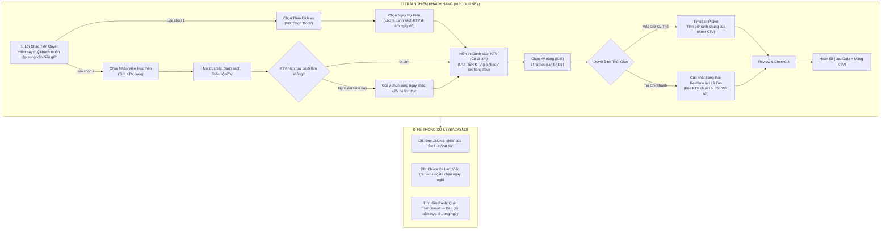

# 🔍 Phân Tích Luồng Menu VIP/Premium - Ngân Hà Spa

> Phiên bản đã được tinh chỉnh Tối Ưu UX (Service-led vs Staff-led) và Bổ sung Business Logic "Lịch làm việc KTV theo ngày".

---

## 📊 Sơ Đồ Luồng VIP Cập Nhật (Hybrid Flow + Date Calendar)

---

## 🎯 Phân Tích Sự Tinh Chỉnh (Tích hợp Lịch Làm Việc KTV)

Để ứng phó với trường hợp "Khách chọn bạn A, nhưng bạn A hôm nay nghỉ làm", hệ thống cần một kiến trúc lịch thông minh:

### Bước 1: Quyền Lựa Chọn Nhu Cầu & Lọc Theo Ngày
- **Hướng 1 (Service-led):** Khách chọn "Chăm sóc Body". Lúc này hệ thống ngầm gán Ngày Mặc Định là **Hôm Nay**. Nếu khách đổi lịch sang **Ngày mai**, thuật toán sẽ quét Lịch Trực (Shift Schedule) của toàn bộ nhân viên vào Ngày Mai -> Sau đó mới mang ra chấm điểm Skill "Body" -> Đẩy các KTV thỏa mãn cả 2 điều kiện (Đi làm Ngày đó + Giỏi Body) lên Top đầu.
- **Hướng 2 (Staff-led):** Khách đi thẳng vào Sảnh KTV để chọn người quen. Khách bấm thẳng vào KTV "Mai Anh".
  - Nếu hôm nay Mai Anh **Nghỉ Ca**: App sẽ bung ra tờ Lịch (`Calendar UI`) nháy sáng các ngày Mai Anh có ca làm tiếp theo (VD: *"Hôm nay Mai Anh đang nghỉ dưỡng sức. Mai Anh có lịch trực vào Thứ 3 (15/4) và Thứ 4 (16/4). Bạn bấm để book lịch ngày báo nhé!"*). Vô cùng tinh tế và níu chân khách.

### Bước 2 & 3: Co-working Team & Skill Builder
- Hệ thống hỗ trợ **Co-working**: Vẫn cho phép khách tick chọn 1 đến 3 KTV làm chung đi làm cùng ngày.
- Khi đã chọn NV xong, mỗi NV sẽ bung ra mảng **SKILLS** của chính họ, đi kèm **THỜI GIAN** kéo từ DB. VD: Khách tích chọn Skill Cổ Vai Gáy của NV A, và Skill Ngâm Chân của NV B. Hệ thống tự cộng duration và tính giá trị thật để đẩy sang thanh toán.

### Bước 4: Thời Gian vs "Chi Nhánh" (Status Trực Tuyến)
Sau khi setup xong nhân sự, ngày làm, và dịch vụ:
- **Chọn Slot Giờ Cụ Thể trong Ngày đã chốt:** App tính toán sự chồng chéo lịch hẹn của nhóm KTV. Đưa ra list các giờ rảnh chung. Nếu có 1 KTV bận, các khung giờ trùng sẽ bị Disable.
- **Báo cáo Tới Chi Nhánh ngay:** Chỉ dùng được nếu Khách chốt KTV làm Ngày Hôm Nay. Nếu đặt cho các Ngày khác thì bắt buộc phải chọn Khung Giờ giữ chỗ.

---

## 📅 Lộ Trình Triển Khai Thực Tế Mới (3 Phase Cập Nhật)

### Phase 1: Mở rộng Back-end & Kéo Schedule KTV
- [ ] API lấy Danh sách KTV kèm **Lịch Làm Việc (Schedules)**: Truy vấn xem từ bảng Data nào (TurnQueue theo ngày, hoặc Cấu hình ca làm) để xác định hôm nay/ngày mai ai có ca.
- [ ] Hàm lấy trạng thái rảnh/bận chuẩn từ `TurnQueue` của các KTV có trực hôm đó.
- [ ] API Skill Tracker: Lọc danh sách NV ưu tiên theo Skill (Jsonb matching).
- [ ] Khởi tạo structure `MenuContext` để handle Day, Staff Array, Custom Skills.

### Phase 2: Chế Tác Giao Diện Đầu Vào (Tâm Lý Học Khách Hàng)
- [ ] **Greeting Screen:** 2 định hướng rõ rệt.
- [ ] **Calendar Interception:** KTV Card Component. Nếu đi làm hiển thị *"🟢 Rảnh lúc X"*. Nếu hôm nay Nghỉ -> Mờ đi nửa thẻ, nháy chữ *"🔴 Đặt lịch vào Thứ X"*, click vào sổ ra bảng chọn ngày của riêng KTV đó.

### Phase 3: Khối Kỹ Năng & Thanh Toán (Skill Builder)
- [ ] KTV's Profile Sheet bao gồm Checklist Kỹ Năng siêu mượt.
- [ ] `TimeSlotPicker` hiển thị dọc/vuốt chip ngang tùy chọn khung giờ cho Ngày đã chọn.
- [ ] Kết nối Checkout (Dồn Array data KTVs, Skills, Slot đẩy vào đơn).
