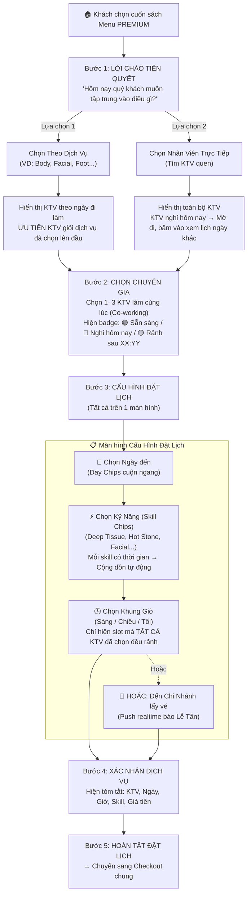

# 🔍 Luồng Menu VIP/Premium – Ngân Hà Spa

> **Phiên bản cuối** – Tổng hợp toàn bộ yêu cầu đã thống nhất.
> Cập nhật: 2026-04-04

---

## 📊 Tổng Quan Luồng (User Journey)



---

## 🚶 Chi Tiết Từng Bước

### Bước 1: Lời Chào Tiên Quyết (Intent Selector)
| Thông tin | Chi tiết |
|-----------|----------|
| **Mục đích** | Phân luồng khách mới vs khách quen |
| **Giao diện** | 2 thẻ lớn có ảnh nền, phong cách Luxury Dark + Gold |
| **Lựa chọn 1** | "Chọn theo dịch vụ" → Dẫn vào chọn Category (Body/Facial/Foot...) → Hệ thống sort KTV có kỹ năng matching lên đầu |
| **Lựa chọn 2** | "Gặp kỹ thuật viên quen" → Đi thẳng vào danh sách KTV |

### Bước 2: Sảnh Chọn Chuyên Gia (Staff Selector)
| Thông tin | Chi tiết |
|-----------|----------|
| **Giao diện** | Gallery card lớn (380px), ảnh toàn thân KTV, gradient overlay |
| **Multi-Select** | 1 khách có thể chọn 1–3 KTV làm cùng lúc (Co-working / Massage 4 tay) |
| **Badge trạng thái** | 🟢 `SẴN SÀNG` · 🟡 `RẢNH SAU 15:30` · 🔴 `NGHỈ HÔM NAY` |
| **Nếu KTV nghỉ** | Thẻ mờ đi, bấm vào hiện Calendar chọn ngày KTV có lịch trực → Book ngày khác |
| **Nếu chọn từ Category** | KTV có matching skill được gắn badge `⭐ ĐỀ XUẤT` và đẩy lên top |
| **Data source** | Bảng `Staff` (avatar, skills JSONB) + `TurnQueue` (status, estimated_end_time) |

### Bước 3: Cấu Hình Đặt Lịch (Booking Config)
Tất cả gộp trên **1 màn hình duy nhất** (không chuyển trang), gồm 4 phần:

| Phần | Chi tiết |
|------|----------|
| **📅 Chọn Ngày** | Day Chips cuộn ngang (5 ngày tới). Chọn ngày → Lọc lại KTV có đi làm ngày đó |
| **⚡ Chọn Kỹ Năng** | Skill Chips (Deep Tissue, Hot Stone, Facial Ritual...). Mỗi chip hiện thời gian (VD: 60p). Chọn xong → Tự cộng dồn tổng thời gian |
| **🕒 Chọn Giờ** | Grid 3 cột, chia 3 buổi (Sáng/Chiều/Tối). Slot bận = disable + gạch ngang. Chỉ hiện slot mà **TẤT CẢ** KTV đã chọn đều rảnh |
| **📍 Tại Chi Nhánh** | Nút thay thế cho chọn giờ. Bấm = Push realtime tới màn Lễ Tân báo "Khách VIP đang đến" |

**Công thức tính giá:**
```
Giá = (Tổng phút / 60) × 200.000 VNĐ
VD: Deep Tissue 60p + Hot Stone 90p = 150p → (150/60) × 200k = 500.000đ
```
> Config key trên Supabase: `SystemConfigs.vip_price_per_60min = 200000`

### Bước 4: Xác Nhận Dịch Vụ (Confirmation)
| Thông tin | Chi tiết |
|-----------|----------|
| **Giao diện** | Banner ảnh trên cùng + Thông tin đặt lịch dạng card tối |
| **Hiển thị** | Avatar KTV, Tên KTV, Ngày/Giờ (hoặc "Tại chi nhánh"), Danh sách Skill, Tổng thời gian, Tổng tiền |
| **CTA** | Nút "HOÀN TẤT ĐẶT LỊCH" → Push payload vào Checkout chung |

### Bước 5: Checkout (Dùng chung)
- Tái sử dụng trang Checkout của Standard Menu
- Bổ sung payload VIP: mảng `technicianCodes`, `timeSlot`, `bookingType`, `skills`
- Database `BookingItems.technicianCodes` (text[]) đã hỗ trợ sẵn nhiều KTV

---

## 🗄️ Database Liên Quan

| Bảng | Vai trò trong luồng VIP |
|------|------------------------|
| `Staff` | Lấy `id`, `full_name`, `avatar_url`, `skills` (JSONB), `gender` để render thẻ KTV |
| `TurnQueue` | Lấy `status` (`waiting`/`working`/`off`) + `estimated_end_time` → Badge rảnh/bận realtime |
| `Services` | Lấy `duration` của từng skill để tính tổng thời gian |
| `SystemConfigs` | Key `vip_price_per_60min` = 200000 → Công thức tính giá VIP |
| `BookingItems` | Cột `technicianCodes` (text[]) lưu mảng KTV phục vụ 1 item |

---

## 🎨 Design System

| Token | Giá trị | Dùng cho |
|-------|---------|----------|
| Surface (nền) | `#131315` | Background chính |
| Primary (gold) | `#e6c487` | Tiêu đề, nút CTA, accent |
| Primary Container | `#c9a96e` | Skill chip selected, badge |
| On Primary | `#412d00` | Chữ trên nút gold |
| On Surface | `#e4e2e4` | Chữ chính |
| On Surface Variant | `#d0c5b5` | Chữ phụ, mô tả |
| Secondary | `#ffb597` | Label phụ (salmon) |
| Error | `#ffb4ab` | Badge "Nghỉ hôm nay" |
| Font Headline | Noto Serif italic | Tiêu đề lớn |
| Font Body | Manrope / Be Vietnam Pro | Nội dung, label |
| Card radius | `2rem` (32px) | Bo góc thẻ KTV, thẻ Intent |

---

## 📁 Cấu Trúc File Hiện Tại

```
src/components/Menu/Premium/
├── index.tsx                  ← State Machine chính (5 bước)
├── mockData.ts                ← Dữ liệu giả (sẽ thay bằng API)
├── premium.constants.ts       ← Design tokens
├── IntentSelector/index.tsx   ← Bước 1: Lời chào
├── CategorySelector/index.tsx ← Chọn nhóm dịch vụ (nếu Service-led)
├── StaffSelector/index.tsx    ← Bước 2: Gallery KTV
├── BookingConfig/index.tsx    ← Bước 3: Ngày + Skill + Giờ
├── ConfirmationScreen/index.tsx ← Bước 4: Xác nhận
├── SkillBuilder/index.tsx     ← (Legacy, đã gộp vào BookingConfig)
└── TimeSlotPicker/index.tsx   ← (Legacy, đã gộp vào BookingConfig)
```
