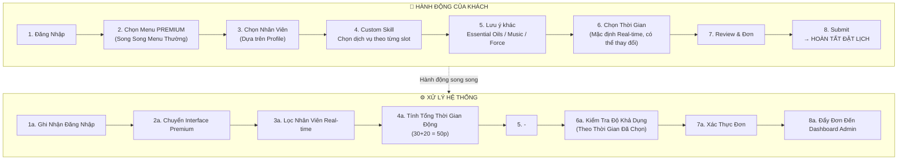

# 🔍 Phân Tích Luồng Menu VIP/Premium - Ngân Hà Spa

> Dựa trên sơ đồ quy trình "Hệ Thống Đặt Lịch VIP/Premium Nội Bộ" và codebase hiện tại.

---

## 📊 Sơ Đồ Luồng VIP (Từ Ảnh)



---

## 🏗️ Trạng Thái Codebase Hiện Tại

### Luồng Standard (ĐÃ HOÀN CHỈNH ✅)

```
[lang]/old-user/select-menu  →  MenuTypeSelector (chọn standard/premium)
         ↓ (chọn "standard")
[lang]/old-user/standard/menu  →  StandardMenu component
         ├─ PICKER:  CategoryPicker (chọn nhóm dịch vụ)
         ├─ MENU:    ServiceList + Header + Footer
         ├─ SHEET:   MainSheet (chọn thời gian/qty)
         ├─ SHEET:   CustomForYouModal (strength/therapist/bodyParts/notes)
         ├─ SHEET:   CartDrawer (review giỏ hàng)
         └─ CHECKOUT: [lang]/old-user/standard/checkout
```

### Luồng VIP (CHƯA TRIỂN KHAI ❌)

```
[lang]/old-user/select-menu  →  MenuTypeSelector (chọn "premium")
         ↓ (chọn "premium")
[lang]/old-user/premium/menu  →  ??? (notFound() - dòng 28 menu/page.tsx)
                                     ↑
                            HIỆN TẠI: TẤT CẢ TRẢ VỀ 404!
```

**File liên quan đang rỗng/placeholder:**
- `src/components/Menu/Premium/Index.tsx` → **File TRỐNG (0 bytes)**
- `src/app/[lang]/books/premium/page.tsx` → **Hiển thị "ComingSoon"**

---

## 🔍 Phân Tích Sự Khác Biệt: Standard vs VIP

| Bước | Standard Menu | VIP Premium Menu |
|------|--------------|------------------|
| **Vào Menu** | Chọn Category → Danh sách dịch vụ | Chọn Nhân Viên TRƯỚC → Rồi mới chọn dịch vụ |
| **Chọn NV** | Sau khi chọn dịch vụ (CustomForYou) | **BƯỚC 3** - Lọc theo Profile & Availability |
| **Buffer Time** | ❌ Không có | ❌ Không có (Giờ được tính tiền trực tiếp) |
| **Custom Skill** | Chọn thời gian từ list (30', 60', 90'...) | **Tự tổ hợp**: Massage Cổ Vai Gáy 30p + Ngâm Chân 20p + ... |
| **Lưu ý khác** | Notes text + tags | **Essential Oils / Music / Massage Force** options |
| **Chọn Giờ** | Không có (chỉ chọn duration) | **REAL-TIME** slot picker dựa trên NV đã chọn |
| **Tính Thời Gian** | Tĩnh (theo từng service) | **Động**: Tính giá dựa trên thời gian (Σ skills) |
| **UI Theme** | Standard dark menu | **Premium Interface** (khác hoàn toàn) |

---

## 🎯 Các Bước Cần Build Cho Luồng VIP (Bản Gốc)

### Bước 1: Route & Page Setup
```
src/app/[lang]/old-user/[menuType]/menu/page.tsx
→ Thêm: if (menuType === 'premium') return <PremiumMenu ... />
```

### Bước 2: PremiumMenu Container
```
src/components/Menu/Premium/
├── Index.tsx          ← Root component (hiện RỖNG)
├── PremiumMenu.logic.ts
└── PremiumMenu.i18n.ts
```

**Logic khác Standard:**
- State `selectedStaff` (KTV đã chọn) → bắt buộc trước khi vào menu
- State `selectedSkills` (danh sách skill tổ hợp tự do)
- State `totalDuration` = Σ(skill.time)
- State `selectedTimeSlot` (slot thực tế từ real-time check)

### Bước 3: Staff Selector (Bước 3 theo sơ đồ)
```
src/components/Menu/Premium/StaffSelector/
├── StaffSelector.tsx   ← Grid/List chọn KTV có profile
└── StaffCard.tsx       ← Card KTV: Ảnh + Tên + Skills + Availability badge
```

**API cần gọi:**
```
GET /api/staff?available=true&date=today
→ Lọc KTV còn "Rảnh - Đặt Ngay" hoặc "Sẽ rảnh lúc..."
```

### Bước 4: Skill Builder (Bước 4 theo sơ đồ)
```
src/components/Menu/Premium/SkillBuilder/
├── SkillBuilder.tsx    ← Checklist các skill có kèm thời gian
└── SkillItem.tsx       ← Row: [✓] Massage Cổ Vai Gáy (30p) / [+] add more
```

**Logic tính tổng:**
```typescript
const totalDuration = selectedSkills.reduce((sum, s) => sum + s.time, 0);
// VD: 30 + 20 = 50p (Tính tiền dựa trên đây)
```

### Bước 5: Preference (Essential Oils, Music, Force)
```
src/components/Menu/Premium/PreferenceSelector/
└── PreferenceSelector.tsx  ← Icon-based selector (3 loại)
```

### Bước 6: Time Slot Picker (Bước 6 theo sơ đồ)
```
src/components/Menu/Premium/TimeSlotPicker/
└── TimeSlotPicker.tsx  ← Horizontal scrollable time chips
```

**Logic:**
- Thời gian hiện tại làm mốc default
- Gọi API check khả dụng của KTV đã chọn + duration đã tính
- Filter ra các slot hợp lệ

### Bước 7-8: Review & Submit
- Tái sử dụng `CartDrawer` / `Invoice` đã có từ Standard
- Thêm thông tin `staffId`, `timeSlot`, `skills`, `preferences`
- Submit đến API `/api/bookings` (đã có cơ bản)


---
---

# 🚀 PHÂN TÍCH BỔ SUNG (YÊU CẦU NÂNG CAO)

> Các yêu cầu này được bổ sung nhằm thiết kế luồng VIP linh hoạt hơn.

## 📊 Sơ Đồ Luồng VIP Cập Nhật (Rẽ Nhánh)

```mermaid
flowchart TB
    subgraph CLIENT["🧑 HÀNH ĐỘNG CỦA KHÁCH"]
        A["1. Đăng Nhập"] --> B["2. Chọn Menu PREMIUM\n(Song Song Menu Thường)"]
        
        B --> OPT["3. Tùy chọn Đặt Lịch"]
        OPT -->|Quyết định sau| B_BRANCH["Đến Chi Nhánh Chọn Tiếp"]
        OPT -->|Quyết định ngay| B_TIME["Chọn Thời Gian Cụ Thể"]

        B_BRANCH --> C["4. Chọn KTV (Multi-Select)\nCó thể chọn nhiều KTV cho nhiều người"]
        B_TIME --> C

        C --> D["5. Custom Skill / Map Dịch Vụ\nGhép nối skill tự do (Massage + Gội...)"]
        D --> E["6. Lưu ý khác\nEssential Oils / Music / Force"]
        
        E --> F{"7. TimeSlot Picker"}
        F -->|B_BRANCH| G["TBD (Chi nhánh quyết định)"]
        F -->|B_TIME| H["Real-time Check:\nTìm slot chung cho tất cả KTV đã chọn"]

        G --> I["8. Đẩy vào Checkout\n(Dùng chung Checkout)"]
        H --> I
        I --> J["9. Hoàn Tất Đặt Lịch"]
    end

    subgraph SYSTEM["⚙️ XỬ LÝ HỆ THỐNG"]
        S1["Lọc KTV Real-time\nTính toán giờ rảnh/bận"]
        S2["Tính Tổng Thời Gian Động\n(Ví dụ: 30+20 = 50p)"]
        S3["Quản lý Giỏ Hàng (Cart Context)\nLưu mốc thời gian và KTV vào LocalStorage"]
        
        CLIENT -.-> SYSTEM
    end
```

## 🎯 Phân Tích Sự Kết Hợp

### 1. Tùy chọn "Thời Gian" hoặc "Tại Chi Nhánh"
- Bước chọn Thời gian/Dịch vụ sẽ có tùy chọn bỏ qua. Đơn hàng gửi đi sẽ có trạng thái `timeSlot: 'TBD'` hoặc `bookingType: 'BRANCH_DECIDE'`, giúp lễ tân biết để sắp xếp khi khách đến.

### 2. Chọn Nhiều KTV (Multi-Therapist Booking)
- Đổi Staff Selector từ "Chỉ chọn 1" thành "Chọn nhiều".
- Giao diện Skill Builder phải chia theo từng KTV (KTV A làm dịch vụ gì, KTV B làm dịch vụ gì).
- Giỏ hàng (Cart) trong `MenuContext` phải mở rộng cấu trúc để map `CartItem` với `staffId` cụ thể khi Push vào đơn.

### 3. Bảng Map Dịch Vụ Theo Khung Giờ (Dynamic Duration)
- Cần "Skill Builder" giao diện trực quan. Các dịch vụ lẻ (skill) được ghép nối lại. Môi skill có thời lượng riêng.
- Tổng thời gian `totalDuration` = Σ(thời gian các kỹ năng). (Sẽ không cộng thêm Buffer Time vì đây là thời gian thực để tính tiền dịch vụ).
- Giao diện hiển thị thanh tiến trình hoặc list cộng dồn thời gian real-time.

### 4. Kiểm Tra Tình Trạng KTV Real-time (Thời gian rảnh)
- Build API `/api/vip/availability` để scan bookings hiện tại của các KTV.
- Trên thẻ KTV: Hiện tag (VD: "Rảnh", "Đang bận - Rảnh lúc 14:30"). Khách có thể thấy KTV bận để chọn khung giờ khác.
- Tại TimeSlot Picker: Chỉ hiện (enable) các khung giờ mà **tất cả** các KTV được chọn đều đang không có lịch.

### 5. Tái Sử Dụng Checkout Chung
- Checkout VIP Flow sẽ **dùng chung Checkout**, chỉ cần thêm data (KTV đã chọn, Khung giờ, Loại hình hẹn) vào `localStorage` hoặc mở rộng payload của `MenuContext`, sau đó Checkout đọc thêm data này để push lên Database.
