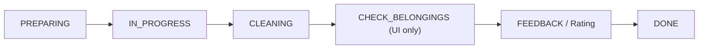

# Plan: Fix Customer Journey — Timer Kẹt 00:00 & Không Chuyển Được Trang Đánh Giá

## 📋 Bối cảnh

Sau khi chuẩn hóa status flow trên hệ thống quản trị (`Quan_Tri_Va_KTV`), trang khách hàng (`wrb-noi-bo-dev`) bị **mất đồng bộ** vì vẫn phụ thuộc vào trạng thái `COMPLETED` cũ.

### Triệu chứng
- Khách quét QR → Trang đồng hồ đếm ngược hiện **00:00** nhưng **không tự chuyển** sang trang "Kiểm tra đồ → Đánh giá"
- Khách bị **kẹt mãi** ở màn hình Timer

### Nguyên nhân gốc rễ (Root Cause)

Trang Journey phía WRB có **3 điểm kiểm tra trạng thái** không khớp với flow mới:

| # | Vị trí | Vấn đề |
|---|--------|--------|
| **R1** | `ServiceList.tsx` dòng 600-602 | `allCompleted` check `['COMPLETED', 'DONE', 'CLEANING']` — nhưng **backend mới không gửi `COMPLETED` nữa**, nên item status sẽ là `CLEANING` hoặc `FEEDBACK`. Nếu item nhảy thẳng `FEEDBACK` thì `allCompleted` = `false` → **kẹt Timer** |
| **R2** | `Journey.logic.ts` dòng 194 | `doneStatuses = ['COMPLETED', 'DONE', 'CLEANING']` — thiếu `FEEDBACK`. Khi item status = `FEEDBACK`, `isCompleted` = `false` → vòng tròn timer không hiện ✅ |
| **R3** | `page.tsx` dòng 97 | State machine check `state === 'COMPLETED'` → show `ServiceList`. Nhưng flow mới **không có `COMPLETED` ở booking level** nữa → nhánh này trở thành dead code, booking có thể rơi vào trạng thái không render gì |
| **R4** | `page.tsx` dòng 36-38 | `derivedStatusRaw` không normalize `CLEANING` → nếu booking status = `CLEANING` mà items chưa started, khách thấy trang trống |

### Flow đúng mong muốn

```
KTV hết giờ → Backend set items = CLEANING → Trang khách tự chuyển sang "Kiểm tra đồ" → Khách xác nhận → Trang đánh giá → DONE
```



---

## 🔧 Kế hoạch sửa (4 file, ~15 dòng thay đổi)

### Bước 1: Mở rộng `allCompleted` trong `ServiceList.tsx`

**File:** `wrb-noi-bo-dev/src/components/Journey/ServiceList.tsx`  
**Dòng:** 600-601

```diff
- const allCompleted = items.length > 0 && items.every(i =>
-     ['COMPLETED', 'DONE', 'CLEANING'].includes(i.status || '')
- );
+ const allCompleted = items.length > 0 && items.every(i =>
+     ['COMPLETED', 'DONE', 'CLEANING', 'FEEDBACK'].includes(i.status || '')
+ );
```

**Lý do:** Khi backend chuyển item sang `FEEDBACK` (ví dụ KTV đã review xong), khách cũng cần được chuyển qua trang Check Belongings.

---

### Bước 2: Mở rộng `doneStatuses` trong `Journey.logic.ts`

**File:** `wrb-noi-bo-dev/src/components/Journey/Journey.logic.ts`  
**Dòng:** 194

```diff
- const doneStatuses = ['COMPLETED', 'DONE', 'CLEANING'];
+ const doneStatuses = ['COMPLETED', 'DONE', 'CLEANING', 'FEEDBACK'];
```

**Lý do:** Cho vòng tròn timer hiện ✅ khi item đã qua giai đoạn phục vụ (bất kể là `CLEANING` hay `FEEDBACK`).

---

### Bước 3: Cập nhật state machine trong `page.tsx`

**File:** `wrb-noi-bo-dev/src/app/[lang]/journey/[bookingId]/page.tsx`

#### 3a. Normalize `derivedStatusRaw` (dòng 36-38)

```diff
  const derivedStatusRaw = (rawStatus === 'NEW' || rawStatus === 'PREPARING') && itemsStarted
      ? 'IN_PROGRESS'
-     : rawStatus === 'NEW' ? 'PREPARING' : rawStatus;
+     : rawStatus === 'NEW' ? 'PREPARING' 
+     : rawStatus === 'COMPLETED' ? 'CLEANING'  // Normalize legacy
+     : rawStatus;
```

#### 3b. Mở rộng `getStepIndex` (dòng 97)

```diff
- if (state === 'COMPLETED' || state === 'FEEDBACK' || state === 'IN_PROGRESS') {
+ if (state === 'CLEANING' || state === 'FEEDBACK' || state === 'IN_PROGRESS') {
```

#### 3c. Mở rộng render condition (dòng 356)

```diff
- {(state === 'IN_PROGRESS' || state === 'COMPLETED' || state === 'FEEDBACK') && (
+ {(state === 'IN_PROGRESS' || state === 'CLEANING' || state === 'FEEDBACK') && (
```

**Lý do:** Booking status `CLEANING` là trạng thái mới thay thế `COMPLETED`. Cần render `ServiceList` (chứa logic auto-transition sang Check Belongings) cho trạng thái này.

---

### Bước 4 (Bonus): Normalize trong `useJourneyRealtime.ts`

Kiểm tra xem hook này có hardcode `COMPLETED` ở đâu không → normalize nếu cần.

---

## 🧪 Test Cases

| # | Scenario | Expected |
|---|----------|----------|
| 1 | Booking status = `CLEANING`, tất cả items = `CLEANING` | Timer hiện ✅, tự chuyển sang Check Belongings |
| 2 | Booking status = `CLEANING`, 1 item = `CLEANING`, 1 item = `IN_PROGRESS` | Timer vẫn chạy cho item đang làm |
| 3 | Khách xác nhận Check Belongings | Chuyển sang trang Rating |
| 4 | Khách đánh giá tất cả items | Booking chuyển DONE, hiện trang "Cảm ơn" |
| 5 | Booking status = `FEEDBACK` (Lễ Tân bấm trước khách) | Hiện ServiceList → auto-chuyển Check Belongings → Rating |
| 6 | Legacy: Booking status vẫn là `COMPLETED` (data cũ) | Normalize về `CLEANING`, flow chạy bình thường |

---

## ⚠️ Rủi ro & Lưu ý

1. **Không cần sửa API endpoint** `/api/journey/update` — API này không check booking status trước khi update, nên không bị block bởi flow mới.
2. **Tương thích ngược**: Giữ `COMPLETED` trong các mảng check để data cũ vẫn chạy đúng.
3. **Repo khác**: Toàn bộ sửa đổi nằm trong repo `wrb-noi-bo-dev`, không ảnh hưởng `Quan_Tri_Va_KTV`.

---

## 📝 Commit Message gợi ý

```
fix: đồng bộ Journey status với flow CLEANING mới, sửa kẹt timer 00:00
```
