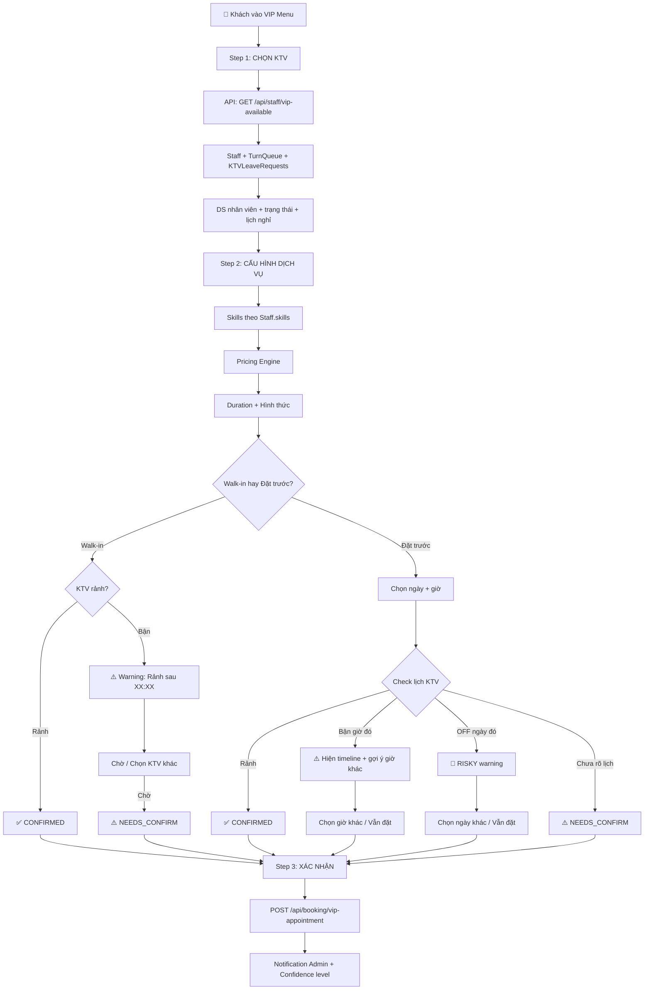

# 📋 Plan: Menu VIP — Chuyển Sang Data Thực (FINAL)

> **Ngày tạo**: 16/05/2026  
> **Cập nhật**: 17/05/2026 16:24 (v4 — Bổ sung Timeline Buffer + Dispatch Integration + Edge Cases)  
> **Trạng thái**: ✅ ĐÃ DUYỆT — Sẵn sàng code  
> **Mục tiêu**: Loại bỏ toàn bộ mock data, kết nối Supabase thực, logic tính giá từ Simulator  

---

## 📊 CÁC QUYẾT ĐỊNH ĐÃ CHỐT

| # | Quyết định | Chi tiết |
|---|-----------|----------|
| 1 | **Skills hiển thị** | Tất cả skills đều hiển thị/ẩn **dựa vào `Staff.skills`** (jsonb) của KTV được chọn |
| 2 | **scrubBody** | Loại CHÍNH, nhưng **TẠM CHẶN** (blocked) — không hiện dù KTV có skill |
| 3 | **hairCut, hairExtensionShampoo** | Loại **LẺ** |
| 4 | **Foot** | UI hiện **1 nút** duy nhất. KTV "biết Foot" = `oilFoot` OR `hotStoneFoot` OR `acupressureFoot` bất kỳ |
| 5 | **Body mix (`bodyMix`)** | Loại CHÍNH — DB key chuẩn là `bodyMix` (không phải `mixBody`) |
| 6 | **Đặt lịch trước** | **Phương án C** — Khách đặt ngày nào cũng được, hệ thống tạo đơn chờ Admin gọi xác nhận |
| 7 | **Bảng giá** | 2 chiều: 1KTV (7 mốc) + 2KTV (7 mốc). Lưu trong `SystemConfigs.menu_vip_pricing` |
| 8 | **machineShave** | Có trong VIP Menu, loại **LẺ** |
| 9 | **Body Shire = `shiatsuBody`** | Confirmed |
| 10 | **Smart Scheduling** | Luôn cho đặt. Nếu KTV bận/OFF → warning + vẫn cho đặt + admin xác nhận |
| 11 | **Booking Confidence** | 3 mức: ✅ CONFIRMED (KTV rảnh) / ⚠️ NEEDS_CONFIRM (bận/chưa rõ) / 🔴 RISKY (OFF) |
| 12 | **Buffer 30 phút** | Slot rảnh sát đơn bận → hiện ⏰ "Dự kiến" + warning, KHÔNG hiện "✅ Rảnh" |
| 13 | **Server-side lock** | POST booking phải re-check availability (chống race condition 2 khách đặt cùng lúc) |
| 14 | **Dispatch VIP Badge** | Đơn VIP hiện badge ★ trên Dispatch Board + warning khi dispatch walk-in cho KTV có VIP hẹn |
| 15 | **Sudden OFF Guard** | KTV xin nghỉ đột xuất khi có VIP booking → Warning + Admin tìm KTV thay thế |
| 16 | **Ca làm việc** | Timeline tham chiếu `KTVShiftRecords` để biết giờ ca → slot ngoài ca = `OFF_SHIFT` |

---

## 🗺️ BẢNG SKILLS VIP MENU — CHÍNH THỨC

### Nhóm LẺ (11 skills)

| # | DB Key | Tên VN | Tên EN | Tên 5 ngôn ngữ (i18n) |
|---|--------|--------|--------|----------------------|
| 1 | `shampoo` | Gội | Shampoo | Vi/En/Cn/Jp/Kr |
| 2 | `earCombo` | Ráy combo | Ear Combo | |
| 3 | `earChuyen` | Ráy chuyên | Ear Pro | |
| 4 | `razorShave` | Cạo dao | Razor Shave | |
| 5 | `machineShave` | Cạo máy | Machine Shave | |
| 6 | `facial` | Facial | Facial | |
| 7 | `nailCombo` | Nail combo | Nail Combo | |
| 8 | `nailChuyen` | Nail chuyên | Nail Pro | |
| 9 | `heelScrub` | Bào gót | Heel Scrub | |
| 10 | `hairCut` | Cắt tóc | Hair Cut | |
| 11 | `hairExtensionShampoo` | Gội nối mi | Hair Extension Shampoo | |

### Nhóm CHÍNH (7 skills)

| # | DB Key | Tên VN | Tên EN | Ghi chú |
|---|--------|--------|--------|---------|
| 12 | `thaiBody` | Body thái | Thai Body | |
| 13 | `shiatsuBody` | Body Shire | Shiatsu Body | |
| 14 | `oilBody` | Body Dầu | Oil Body | |
| 15 | `hotStoneBody` | Body Đá | Hot Stone Body | |
| 16 | `bodyMix` | Body mix | Mix Body | ✅ DB key chuẩn = `bodyMix` |
| 17 | `foot` *(composite)* | Foot | Foot | = `oilFoot` OR `hotStoneFoot` OR `acupressureFoot` |

### 🚫 Tạm chặn (BLOCKED)

| DB Key | Tên VN | Lý do |
|--------|--------|-------|
| `scrubBody` | Body Scrub | Loại CHÍNH nhưng tạm thời không sử dụng |

### Quy tắc hiển thị Skills

```
1. Khách chọn KTV (1 hoặc nhiều)
2. Lấy Staff.skills của từng KTV
3. Tính GIAO (intersection) skills nếu chọn 2+ KTV
   → Chỉ hiện skills mà TẤT CẢ KTV đều biết
4. Loại bỏ skills trong BLOCKED list (scrubBody)
5. Áp dụng quy tắc composite:
   - "foot" hiện nếu BẤT KỲ oilFoot/hotStoneFoot/acupressureFoot = true
6. Skills hiện ra → Khách tick chọn → Tính minDuration + giá
```

---

## 💰 BẢNG GIÁ CHÍNH THỨC

### 1 KTV

| 60 phút | 70 phút | 90 phút | 120 phút | 150 phút | 180 phút | 240 phút |
|---------|---------|---------|----------|----------|----------|----------|
| 720,000đ | 840,000đ | 1,080,000đ | 1,440,000đ | 1,800,000đ | 2,160,000đ | 2,880,000đ |

### 2 KTV

| 60 phút | 70 phút | 90 phút | 120 phút | 150 phút | 180 phút | 240 phút |
|---------|---------|---------|----------|----------|----------|----------|
| 1,080,000đ | 1,260,000đ | 1,620,000đ | 2,160,000đ | 2,700,000đ | 3,240,000đ | 4,320,000đ |

### Logic thời gian tối thiểu (từ Simulator)

```
Quy tắc tính minDuration theo skills đã chọn:

1. Đếm: leCount (LẺ), chinhCount (CHÍNH), totalCount = leCount + chinhCount

2. Mặc định: minDuration = 60 phút
   ✅ Bao gồm: chỉ LẺ, chỉ 1 CHÍNH, 2 LẺ, hoặc 2 CHÍNH (Body+Foot)
   💡 Lý do 2 CHÍNH = 60p: Body thường đã bao gồm Foot, nên combo này
      không cần thêm thời gian.

3. Nếu (leCount >= 1 VÀ chinhCount >= 1) HOẶC (chinhCount > 2):
   → minDuration = 70 phút
   ⚠️ Chú ý: chinhCount > 2 (tức >= 3 CHÍNH), KHÔNG phải >= 2.
   Nên 2 CHÍNH (VD: Body thái + Foot) vẫn ở mốc 60 phút.

4. Nếu totalCount >= 3: minDuration = 90 phút
5. Nếu totalCount >= 4: minDuration = 120 phút  
6. Nếu totalCount >= 5: minDuration = 150 phút

7. Ẩn tất cả mốc thời gian < minDuration
8. Auto-select mốc thời gian thấp nhất hợp lệ nếu đang chọn mốc bị ẩn
```

**Bảng ví dụ minh hoạ:**

| Combo khách chọn | LẺ | CHÍNH | Total | minDuration |
|------------------|-----|-------|-------|-------------|
| Gội | 1 | 0 | 1 | **60p** |
| Body thái + Foot | 0 | 2 | 2 | **60p** ✅ (body đã gồm foot) |
| Gội + Body thái | 1 | 1 | 2 | **70p** (mix LẺ+CHÍNH) |
| Gội + Ráy + Body thái | 2 | 1 | 3 | **90p** (≥3 tổng) |
| Gội + Ráy + Facial + Body thái | 3 | 1 | 4 | **120p** (≥4 tổng) |
| Gội + Ráy + Facial + Nail + Body thái | 4 | 1 | 5 | **150p** (≥5 tổng) |

---

## 📅 SMART SCHEDULING — LOGIC LỊCH KTV THÔNG MINH

> **Nguyên tắc vàng**: LUÔN CHO ĐẶT. Hệ thống warning rõ ràng + Admin xác nhận khi cần.

### 3 Mức Booking Confidence

| Mức | Icon | Điều kiện | Hành vi UI | Booking status |
|-----|------|-----------|------------|----------------|
| ✅ **CONFIRMED** | 🟢 | KTV rảnh + đúng ngày làm | Đặt ngay, không cần confirm | `NEW` |
| ⚠️ **NEEDS_CONFIRM** | 🟡 | KTV đang bận tua / Ngày tương lai chưa rõ lịch | Warning + vẫn cho đặt + admin xác nhận | `PENDING_CONFIRM` |
| 🔴 **RISKY** | 🔴 | KTV đã xin OFF ngày đó | Warning nổi bật + vẫn cho đặt + admin xác nhận bắt buộc | `PENDING_CONFIRM` |

### Kịch bản chi tiết

#### Kịch bản 1: Walk-in — KTV đang bận tua

```
👤 Khách chọn KTV "Phát" (NH001)
→ Hệ thống check TurnQueue: status = 'working', estimated_end_time = '15:30'

📱 UI hiển thị:
┌─────────────────────────────────────────────┐
│ 🟡 KTV Phát đang phục vụ khách              │
│ ⏰ Dự kiến rảnh lúc: 15:30                  │
│                                             │
│ [Chờ KTV Phát]  [Chọn KTV khác]             │
└─────────────────────────────────────────────┘

→ Nếu khách chọn "Chờ": Tạo booking, timeBooking = '15:30'
   Booking confidence = NEEDS_CONFIRM
→ Admin nhận notification: "Khách VIP chờ KTV Phát, hẹn 15:30"
```

#### Kịch bản 2: Đặt trước — KTV OFF ngày đó

```
👤 Khách chọn KTV "Phát" (NH001) + Ngày 17/05
→ Hệ thống check KTVLeaveRequests: date = '2026-05-17', status = 'APPROVED'

📱 UI hiển thị:
┌─────────────────────────────────────────────┐
│ 🔴 KTV Phát đã xin nghỉ ngày 17/05         │
│                                             │
│ Bạn vẫn có thể đặt lịch.                   │
│ Tiệm sẽ liên hệ xác nhận lại với bạn.      │
│                                             │
│ [Vẫn đặt KTV Phát]  [Chọn ngày khác]       │
└─────────────────────────────────────────────┘

→ Nếu khách chọn "Vẫn đặt": Tạo booking, confidence = RISKY
→ Admin nhận notification: "⚠️ Khách VIP đặt KTV Phát ngày 17/05 (KTV đang OFF)"
```

#### Kịch bản 3: Đặt trước — Ngày tương lai (không rõ lịch)

```
👤 Khách chọn KTV "Phát" + Ngày 20/05
→ Hệ thống check: Không có TurnQueue ngày 20/05 (chưa tới)
→ Không có KTVLeaveRequests record cho ngày 20/05

📱 UI hiển thị:
┌─────────────────────────────────────────────┐
│ 📅 Đặt lịch ngày 20/05                     │
│ Tiệm sẽ xác nhận lịch KTV Phát             │
│ và liên hệ lại với bạn.                     │
│                                             │
│ [Xác nhận đặt lịch]                         │
└─────────────────────────────────────────────┘

→ Booking confidence = NEEDS_CONFIRM
→ Admin nhận notification: "Khách VIP đặt KTV Phát ngày 20/05, chờ xác nhận lịch"
```

#### Kịch bản 4: Walk-in — KTV rảnh (Happy path)

```
👤 Khách chọn KTV "Phát" → TurnQueue: status = 'waiting'
→ Booking confidence = CONFIRMED
→ Đặt ngay, không cần admin confirm
```

### Timeline Visual — Hiển thị lịch KTV trong ngày

Khi khách chọn "Đặt Lịch Trước" + chọn ngày **hôm nay**:

```
📅 Lịch KTV Phát — Hôm nay (17/05)

08:00 ████████████ Đang phục vụ (75 phút)
09:00 ████████████
09:15 ⏰⏰⏰⏰⏰⏰ Dự kiến rảnh (!) Sát đơn trước → warning
09:45 ░░░░░░░░░░░░ Rảnh ← ✨ Đề xuất (có buffer 30p)
10:00 ░░░░░░░░░░░░ Rảnh
11:00 ░░░░░░░░░░░░ Rảnh
12:00 ░░░░░░░░░░░░ Rảnh
12:30 ⚠️⚠️⚠️⚠️⚠️⚠️ Rảnh (!) Gần đơn hẹn 13:00
13:00 ▓▓▓▓▓▓▓▓▓▓▓▓ Đơn hẹn giờ (dự kiến 150 phút)
15:00 ▓▓▓▓▓▓▓▓▓▓▓▓
15:30 ★★★★★★★★★★★★ VIP đã đặt trước (90 phút)
17:00 ⏰⏰⏰⏰⏰⏰ Dự kiến rảnh (!) Sát VIP trước đó
17:30 ░░░░░░░░░░░░ Rảnh ← ✨ Đề xuất
...
22:00 (Kết thúc)
```

**Chú giải UI:**

| Icon | Ý nghĩa | Cho đặt? |
|------|---------|----------|
| ████ | Đang phục vụ (confirmed) | ❌ |
| ▓▓▓▓ | Đơn hẹn giờ (dự kiến) | ❌ |
| ★★★★ | VIP đã đặt trước | ❌ |
| ⏰⏰ | Dự kiến rảnh (buffer < 30p) | ✅ + warning |
| ░░░░ | Rảnh (buffer ≥ 30p) | ✅ |
| ✨ | Slot đề xuất (tối ưu) | ✅ Ưu tiên |

**Thuật toán Timeline Builder** (`vipTimelineBuilder.ts`):

```
Input: ktvId, date
Output: slots[] (mỗi slot = 15 phút)

1. Tạo mảng 56 slots (08:00→22:00, mỗi 15p) → mặc định FREE
2. Đánh dấu BUSY: TurnQueue (status=working) + Bookings (IN_PROGRESS)
3. Đánh dấu BUSY_ESTIMATED: Bookings (timeBooking != null, status=NEW)
4. Đánh dấu VIP_BOOKED: Bookings (notes.type=VIP_APPOINTMENT)
5. Đánh dấu OFF_SHIFT: KTVShiftRecords (ngoài giờ ca)
6. Tính buffer: slot FREE sát slot bận (< 30p) → gắn flag bufferWarning
7. Tìm khoảng rảnh liên tiếp ≥ minDuration → gợi ý cho khách
```

Khi chọn **ngày tương lai** → không có timeline (chưa rõ lịch), chỉ chọn giờ mong muốn + check KTVLeaveRequests.

### Chọn 2+ KTV — Logic giao lịch

Nếu khách chọn 2 KTV (VD: NH001 + NH003):
1. Lấy lịch **CẢ 2** KTV
2. Tính **giao** (intersection) các khung giờ rảnh
3. Chỉ hiện time slots mà **CẢ 2** đều rảnh
4. Nếu 1 KTV bận + 1 rảnh → warning cụ thể KTV nào bận
5. Nếu 1 KTV OFF → warning RISKY cho KTV đó, KTV kia vẫn OK

---

## 🏗️ KIẾN TRÚC TỔNG QUAN



---

## 🔧 PHA 0: SQL & SystemConfigs

### Task 0.1: Cập nhật bảng giá VIP

```sql
UPDATE "SystemConfigs"
SET 
  value = '{
    "1": {"60": 720000, "70": 840000, "90": 1080000, "120": 1440000, "150": 1800000, "180": 2160000, "240": 2880000},
    "2": {"60": 1080000, "70": 1260000, "90": 1620000, "120": 2160000, "150": 2700000, "180": 3240000, "240": 4320000}
  }'::jsonb,
  description = 'Bảng giá Menu VIP v2: key "1"=1KTV, key "2"=2KTV. Value = {duration_phút: giá_VND}',
  updated_at = NOW()
WHERE key = 'menu_vip_pricing';
```

### Task 0.2: Thêm skill `mixBody` vào tất cả Staff

```sql
-- Thêm key mixBody = false cho tất cả staff chưa có
UPDATE "Staff"
SET skills = skills || '{"mixBody": false}'::jsonb
WHERE skills IS NOT NULL
  AND NOT (skills ? 'mixBody');
```

> ⚠️ Sau đó cần update `mixBody = true` cho những KTV thực sự biết Body mix.

---

## 🔧 PHA 1: Constants & Pricing Engine

### Task 1.1: Tạo `src/lib/vipSkills.constants.ts`

Danh sách 18 skills chính thức (11 LẺ + 7 CHÍNH) với:
- DB key mapping
- Tên 5 ngôn ngữ (vi, en, cn, jp, kr)
- Type: LE | CHINH
- `blocked: boolean` (scrubBody = true)
- `composite` flag cho Foot

### Task 1.2: Tạo `src/lib/vipPricingEngine.ts`

Port logic từ Simulator:
- Input: `selectedSkillIds[]`, `numStaff (1|2)`, `selectedDuration`, `pricingTable`
- Output: `{ leCount, chinhCount, totalCount, minDuration, availableDurations, price }`
- Logic tính `minDuration` giống Simulator (đã chốt ở trên)

### Task 1.3: Tạo `src/lib/vipStaffUtils.ts`

Utility xử lý:
- `getCompositeSkills(staffSkills)` → merge 3 foot skills thành 1 "foot"
- `getIntersectionSkills(staff[])` → tính giao skills khi chọn 2+ KTV
- `filterBlockedSkills(skills[])` → loại `scrubBody`

---

## 🔧 PHA 2: API Nhân Viên Thực

### Task 2.1: Tạo `GET /api/staff/vip-available`

**Query**:
```sql
SELECT s.id, s.full_name, s.avatar_url, s.gender, s.skills, s.height,
       tq.status as queue_status, tq.estimated_end_time, tq.current_order_id
FROM "Staff" s
LEFT JOIN "TurnQueue" tq ON tq.employee_id = s.id AND tq.date = CURRENT_DATE
WHERE s.status = 'ĐANG LÀM'
ORDER BY 
  CASE WHEN tq.status = 'waiting' THEN 0
       WHEN tq.status IS NOT NULL THEN 1
       ELSE 2 END,
  s.full_name
```

**Thêm check KTVLeaveRequests** (bảng riêng quản lý lịch nghỉ):
```sql
-- Check ai OFF hôm nay
SELECT "employeeId" FROM "KTVLeaveRequests"
WHERE date = CURRENT_DATE
  AND status IN ('APPROVED', 'PENDING')
```

> ⚠️ **LƯU Ý**: Hệ thống dùng bảng `KTVLeaveRequests` (KHÔNG phải `KTVAttendance`) để quản lý lịch OFF.
> Mỗi ngày OFF = 1 record riêng với cột `date` (kiểu date). KTV xin OFF nhiều ngày → nhiều records.

**Response**: Trả về trạng thái mỗi KTV:
- `AVAILABLE` (trong TurnQueue, status=waiting)
- `BUSY` (status=working/assigned) + `availableAfter`
- `OFF_TODAY` (không có trong TurnQueue + không có trong KTVLeaveRequests)
- `ON_LEAVE` (có record trong KTVLeaveRequests, status=APPROVED)

### Task 2.2: Tạo `GET /api/staff/check-availability`

**Params**: `staffIds=NH001,NH003&date=2026-05-20&time=15:00`

**Logic**:
1. Check `KTVLeaveRequests` cho ngày đó → ai có record OFF (status = APPROVED/PENDING)?
   ```sql
   SELECT "employeeId" FROM "KTVLeaveRequests"
   WHERE date = :targetDate
     AND status IN ('APPROVED', 'PENDING')
     AND "employeeId" IN (:staffIds)
   ```
2. Nếu ngày = hôm nay → check `TurnQueue` cho giờ cụ thể:
   - KTV có `estimated_end_time` > giờ khách chọn → BUSY
   - Nếu không → AVAILABLE
3. Nếu ngày = tương lai → không có TurnQueue → check `KTVLeaveRequests`:
   - Có record OFF → RISKY
   - Không có record → trả `UNKNOWN` (chưa rõ lịch)

**Response**:
```typescript
interface AvailabilityCheckResponse {
  results: {
    staffId: string;
    staffName: string;
    status: 'AVAILABLE' | 'BUSY' | 'OFF' | 'UNKNOWN';
    reason?: string;
    availableAfter?: string;  // "15:30" nếu bận
    confidence: 'CONFIRMED' | 'NEEDS_CONFIRM' | 'RISKY';
  }[];
  overallConfidence: 'CONFIRMED' | 'NEEDS_CONFIRM' | 'RISKY';
  warnings: string[];  // Mảng warning messages để hiện UI
}
```

**Dùng khi**: 
- Walk-in: Sau khi chọn KTV → check realtime
- Đặt trước: Chọn ngày + giờ → auto-check tất cả KTV

---

## 🔧 PHA 3: Refactor UI Components

### Task 3.1: Refactor `StaffSelector/index.tsx`

**Thay đổi**:
- ❌ Xóa `import { mockStaff } from '../mockData'`
- ✅ `useEffect` → fetch `GET /api/staff/vip-available`
- ✅ Skeleton loading (shimmer cards) khi đang fetch
- ✅ Avatar: dùng `staff.avatar_url`, fallback `ui-avatars.com`
- ✅ Badge trạng thái realtime:
  - 🟢 SẴN SÀNG (AVAILABLE)
  - 🟡 ĐANG BẬN — Rảnh sau 15:30 (BUSY)
  - 🔴 NGHỈ HÔM NAY (OFF_TODAY)
  - 🟣 NGHỈ PHÉP (ON_LEAVE)
- ✅ Hiện skill tags trên card (pills nhỏ bên dưới tên KTV)
- ✅ Giữ nguyên search by staff code

### Task 3.2: Refactor `BookingConfig/index.tsx`

**Thay đổi**:
- ❌ Xóa `import { mockSkills, mockTimeSlots } from '../mockData'`
- ✅ Import `VIP_SKILLS` từ constants
- ✅ Nhận `staffList` (data thực) từ parent → lấy `skills` từng KTV
- ✅ Hiện skills theo quy tắc đã chốt (intersection + blocked + composite)
- ✅ Tích hợp `vipPricingEngine`:
  - Khi tick/untick skill → recalc `minDuration` → ẩn/hiện duration options
  - Khi chọn 1 vs 2 KTV → switch bảng giá
  - Duration selector hiện giá bên cạnh (giống Simulator)

**Smart Scheduling trong BookingConfig**:

- ✅ **Walk-in**: Sau khi chọn KTV:
  - KTV rảnh → hiện "✅ KTV sẵn sàng phục vụ"
  - KTV bận → hiện warning card:
    - "⚠️ KTV [Tên] đang phục vụ, dự kiến rảnh lúc [XX:XX]"
    - 2 nút: [Chờ KTV] + [Chọn KTV khác]
    - Nếu chờ → `confidence = NEEDS_CONFIRM`

- ✅ **Đặt trước**: Sau khi chọn ngày:
  - Gọi `check-availability` API
  - Hiện **timeline visual** nếu chọn ngày hôm nay (hiện các block rảnh/bận)
  - **KTV OFF**: Warning card đỏ:
    - "🔴 KTV [Tên] đã xin nghỉ ngày [DD/MM]"
    - "Bạn vẫn có thể đặt. Tiệm sẽ liên hệ xác nhận."
    - 2 nút: [Vẫn đặt KTV này] + [Chọn ngày khác]
    - Nếu vẫn đặt → `confidence = RISKY`
  - **KTV bận giờ đó**: Warning card vàng + gợi ý giờ khác
  - **Chưa rõ lịch** (ngày tương lai): Info card:
    - "📅 Tiệm sẽ xác nhận lịch KTV và liên hệ lại bạn."
    - `confidence = NEEDS_CONFIRM`
  - Time slots: hiện dải giờ 08:00-21:00 (mỗi 30 phút)
  - Nếu hôm nay: đánh dấu time slots bận bằng gạch ngang + tooltip

### Task 3.3: Sửa `ConfirmationScreen/index.tsx`

- Hiện tóm tắt: KTV + Skills + Duration + Giá + Ngày/Giờ
- **Hiện Confidence Badge**:
  - ✅ CONFIRMED: Badge xanh "Đặt lịch thành công!"
  - ⚠️ NEEDS_CONFIRM: Badge vàng "Tiệm sẽ liên hệ xác nhận lịch với bạn"
  - 🔴 RISKY: Badge đỏ "Lưu ý: KTV [Tên] đã xin nghỉ ngày này. Tiệm sẽ liên hệ sớm nhất."
- Nút "Xác Nhận" → gọi API tạo booking + truyền `confidence` level
- Hiện thông tin liên hệ tiệm (SĐT) để khách gọi nếu cần

### Task 3.4: Sửa `Premium/index.tsx` (parent)

- Truyền `staffList` (data thực) xuống BookingConfig thay vì chỉ `staffIds`
- Truyền `pricingTable` (2 chiều) thay vì `vipPricing` (mảng cũ)

---

## 🔧 PHA 4: Nâng Cấp API Đặt Lịch

### Task 4.1: Sửa `POST /api/booking/vip-appointment`

**Thêm logic**:
1. **Server-side pricing validation**: Tính lại giá bằng `vipPricingEngine`, không tin client
2. **Validate duration ≥ minDuration** theo skills đã chọn
3. **🆕 Server-side availability lock (chống Race Condition)**:
   ```typescript
   // Re-check timeline NGAY TRƯỚC khi insert
   const currentTimeline = await buildServerTimeline(staffIds, date);
   const requestedSlots = getSlots(timeBooking, duration);
   const conflict = requestedSlots.find(s => currentTimeline[s] !== 'FREE');
   if (conflict) {
     return { error: 'SLOT_TAKEN', suggestedSlots: findNearestFree(currentTimeline, duration) };
   }
   ```
4. **Set booking status theo confidence**:
   - `CONFIRMED` → `status = 'NEW'` (đơn sẵn sàng dispatch)
   - `NEEDS_CONFIRM` → `status = 'PENDING_CONFIRM'` (chờ admin)
   - `RISKY` → `status = 'PENDING_CONFIRM'` + flag `isRisky = true`
5. **Lưu metadata confidence** vào `Bookings.notes` (jsonb):
   ```typescript
   notes: {
     type: 'VIP_APPOINTMENT',
     confidence: 'NEEDS_CONFIRM',
     warnings: ['KTV Phát đã xin nghỉ ngày 17/05'],
     selectedSkills: ['shampoo', 'thaiBody', 'foot'],
     bufferWarning: true,  // true nếu slot sát đơn bận
   }
   ```
6. **Tạo BookingItems** — mỗi skill chọn = 1 BookingItem:
   ```typescript
   selectedSkills.map(skillId => ({
     bookingId,
     serviceId: mapSkillToServiceId(skillId),
     technicianCodes: selectedStaffIds,
     status: 'WAITING',
   }))
   ```
7. **Gửi notification Admin** theo confidence:
   - ✅ CONFIRMED: "📋 Đặt lịch VIP — [Tên khách] — [Duration] — [KTV]"
   - ⚠️ NEEDS_CONFIRM: "⚠️ Đặt lịch VIP CẦN XÁC NHẬN — [Tên khách] — KTV [Tên] đang bận"
   - 🔴 RISKY: "🔴 ĐẶT LỊCH VIP KHẨN — [Tên khách] muốn KTV [Tên] ngày [DD/MM] (KTV ĐÃ XIN NGHỈ)"

---

## 🔧 PHA 4.5: Dispatch Integration (Admin Side)

> Đảm bảo hệ thống dispatch hiện tại tương thích với VIP booking.

### Task 4.5.1: VIP Badge trên Dispatch Board

- Đơn có `notes.type = 'VIP_APPOINTMENT'` → hiện badge ⭐ VIP
- Sắp xếp: VIP ưu tiên hiện trước đơn thường cùng giờ
- Màu sắc riêng: viền vàng/gradient khác đơn thường

### Task 4.5.2: Dispatch Warning — KTV có VIP hẹn

Khi admin dispatch walk-in cho KTV:
```
1. Check Bookings tương lai hôm nay có KTV đó:
   WHERE technicianCode = :ktvId
     AND status IN ('NEW', 'PENDING_CONFIRM')
     AND notes->>'type' = 'VIP_APPOINTMENT'
     AND bookingDate = CURRENT_DATE
     AND timeBooking > NOW()

2. Nếu có → hiện warning:
   "⚠️ NH001 có VIP hẹn lúc 15:30 (90 phút).
    Nếu dispatch đơn này (ước tính xong ~15:00),
    KTV có thể trễ VIP."
   
   [Vẫn dispatch] [Chọn KTV khác]
```

### Task 4.5.3: Sudden OFF Guard

Khi KTV xin nghỉ đột xuất (qua `/api/ktv/leave`):
```
1. Check VIP booking chưa xong của KTV ngày đó:
   WHERE technicianCode = :ktvId
     AND notes->>'type' = 'VIP_APPOINTMENT'
     AND status NOT IN ('DONE', 'CANCELLED')
     AND bookingDate = :offDate

2. Nếu có → KHÔNG block, nhưng:
   a. Warning KTV: "Bạn có VIP hẹn lúc 15:30. Nếu nghỉ, admin sẽ tìm KTV thay."
   b. Auto-notify Admin: "🔴 KTV [Tên] xin nghỉ đột xuất. Có VIP booking [ID] lúc [XX:XX]."
   c. Đề xuất KTV thay thế: tìm KTV có skill tương đương + rảnh giờ đó
```

---

## 🔧 PHA 5: Cleanup & Polish

| Task | Mô tả |
|------|--------|
| 5.1 | Xóa/deprecate `mockData.ts` |
| 5.2 | Tạo `Premium.i18n.ts` — 5 ngôn ngữ cho tất cả text |
| 5.3 | Skeleton loading, error toast, retry |
| 5.4 | Test edge cases: KTV không có skill nào, chọn 2 KTV không có skill chung |
| 5.5 | 🆕 Test race condition: 2 tab đặt cùng KTV cùng giờ → verify server-side lock |
| 5.6 | 🆕 Test buffer warning: đặt slot sát đơn bận → verify hiện ⏰ "Dự kiến" |
| 5.7 | 🆕 Test dispatch warning: dispatch walk-in cho KTV có VIP hẹn → verify warning |

---

## 📂 Danh Sách Files

| File | Action | Mô tả |
|------|--------|--------|
| `src/lib/vipSkills.constants.ts` | 🆕 | 18 skills (11 LẺ + 7 CHÍNH) + blocked list |
| `src/lib/vipPricingEngine.ts` | 🆕 | Logic tính giá + minDuration |
| `src/lib/vipStaffUtils.ts` | 🆕 | Composite foot, intersection, blocked filter |
| `src/lib/vipTimelineBuilder.ts` | 🆕 | Thuật toán timeline 15-phút slots + buffer logic |
| `src/app/api/staff/vip-available/route.ts` | 🆕 | API nhân viên thực + trạng thái |
| `src/app/api/staff/check-availability/route.ts` | 🆕 | API check lịch OFF + timeline multi-KTV |
| `src/app/api/config/menu-vip/route.ts` | ✏️ | Trả pricing v2 (bảng 2 chiều) |
| `src/app/api/booking/vip-appointment/route.ts` | ✏️ | Validation + Server-side lock + BookingItems |
| `src/components/Menu/Premium/index.tsx` | ✏️ | Truyền data thực xuống children |
| `src/components/Menu/Premium/StaffSelector/index.tsx` | ✏️ | Fetch staff thực, bỏ mock |
| `src/components/Menu/Premium/BookingConfig/index.tsx` | ✏️ | Skills thực, pricing engine, timeline visual |
| `src/components/Menu/Premium/ConfirmationScreen/index.tsx` | ✏️ | Hiện advance booking note + buffer warning |
| `src/components/Menu/Premium/Premium.i18n.ts` | 🆕 | Dictionary 5 ngôn ngữ |
| `src/components/Menu/Premium/mockData.ts` | 🗑️ | Deprecate |

**Phía Admin (Quan_Tri_Va_KTV):**

| File | Action | Mô tả |
|------|--------|--------|
| `app/reception/dispatch/page.tsx` | ✏️ | VIP badge + dispatch warning |
| `app/api/ktv/leave/route.ts` | ✏️ | Sudden OFF guard: check VIP booking |

---

## 📅 Timeline

| Pha | Thời gian | Ghi chú |
|-----|-----------|---------|
| Pha 0 (SQL) | 15 phút | ✅ Đã chạy |
| Pha 1 (Constants + Engine) | 1-2h | Không phụ thuộc |
| Pha 2 (API Staff + Timeline) | 3-4h | Song song Pha 1, bao gồm timeline builder |
| Pha 3 (UI Refactor) | 4-6h | Phần lớn nhất |
| Pha 4 (API Booking + Lock) | 2-3h | Bao gồm server-side lock |
| Pha 4.5 (Dispatch Integration) | 2-3h | VIP badge + warning + Sudden OFF guard |
| Pha 5 (Polish + Test) | 2-3h | Bao gồm edge case tests |
| **Tổng** | **~15-22h** | |

---

## ⚠️ EDGE CASES ĐÃ PHÂN TÍCH (Tham khảo)

> Chi tiết đầy đủ: xem [analysis_vip_timeline_dispatch.md]

| # | Case | Mức | Giải pháp |
|---|------|-----|----------|
| EC1 | Khách đặt ngay sau estimated_end | 🔴 | Buffer 30p + warning "dự kiến" |
| EC2 | VIP chồng lấn đơn hẹn giờ | 🔴 | Block slot bận + gợi ý slot gần nhất |
| EC3 | 2 khách VIP đặt cùng lúc (Race Condition) | 🔴 | Server-side re-check trước khi INSERT |
| EC4 | Walk-in chen giữa 2 VIP | 🟡 | Dispatch warning cho admin |
| EC5 | KTV Sudden OFF khi có VIP | 🔴 | Warning + Admin + KTV thay thế |
| EC6 | Đơn kéo dài hơn dự kiến | 🟡 | Buffer 30p + Admin alert |
| EC7 | 2 KTV lịch rảnh khác nhau | 🟢 | Intersection + warning |
| EC8 | KTV chưa check-in khi có VIP | 🟡 | Push notification + Admin alert |
