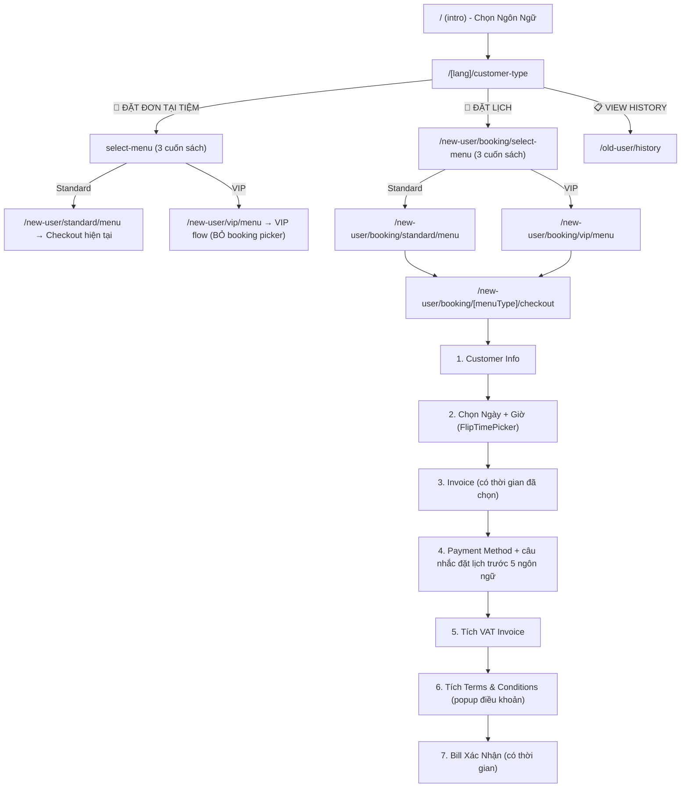

# Plan: Tách Luồng "Đặt Tại Tiệm" vs "Đặt Lịch" — Hướng B

> **Trạng thái**: ✅ Đã duyệt  
> **Ngày tạo**: 2026-06-14  
> **Dự kiến thực hiện**: 2-3 ngày làm việc  
> **Project**: wrb-noi-bo-dev (Web Nội Bộ Ngân Hà Spa)

---

## Tóm Tắt Yêu Cầu

Thêm tính năng **Đặt lịch (Advance Booking)** với folder route mới `/[lang]/new-user/booking/`, tách biệt hoàn toàn khỏi luồng walk-in hiện tại.

### Thay đổi chính:
1. **Customer-type page**: Xoá nút "NEW ORDER" → Thay bằng 2 nút: "Đặt đơn tại tiệm" + "Đặt lịch"
2. **VIP menu**: Bỏ 2 nút chọn "tại tiệm / đặt lịch" trong BookingConfig (vì đã xác định từ đầu)
3. **Booking flow mới**: Folder `/booking/` riêng với checkout có Date/Time Picker, Payment, VAT, Terms & Conditions
4. **HomeSpa**: Vẫn Coming Soon trong cả 2 luồng

---

## Bản Đồ Luồng Mới



---

## Cấu Trúc Folder Mới

```
src/app/[lang]/new-user/booking/
├── select-menu/
│   └── page.tsx              ← [NEW] Reuse MenuTypeSelector component
├── [menuType]/
│   ├── menu/
│   │   └── page.tsx          ← [NEW] Reuse Standard/Premium menu components  
│   └── checkout/
│       └── page.tsx          ← [NEW] ⭐ Booking Checkout (trọng tâm)

src/components/Booking/
├── BookingTimePicker.tsx      ← [NEW] Reuse FlipTimePicker + Day chips từ VIP
├── BookingCheckout.i18n.ts    ← [NEW] i18n 5 ngôn ngữ
├── BookingTermsModal.tsx      ← [NEW] Popup điều khoản (fetch SpaPolicies)
└── BookingConfirmModal.tsx    ← [NEW] Bill xác nhận (extend OrderConfirmModal + time)
```

---

## Chi Tiết Thay Đổi Theo Phase

### Phase 1: Customer-Type Page (Màn Welcome) — ~1.5 giờ

| File | Hành động | Mô tả |
|------|-----------|-------|
| `src/app/[lang]/customer-type/page.tsx` | MODIFY | Xoá nút "NEW ORDER" → 2 nút mới (tại tiệm + đặt lịch). Giữ nút VIEW HISTORY |
| `src/app/[lang]/customer-type/CustomerType.logic.ts` | MODIFY | Thêm `onSelectWalkIn()` + `onSelectAdvance()` với sessionStorage |
| `src/app/[lang]/customer-type/CustomerType.i18n.ts` | MODIFY | Thêm key dịch 5 ngôn ngữ cho 2 nút mới |

### Phase 2: Booking Route + Checkout Page — ~6-8 giờ ⭐

| File | Hành động | Mô tả |
|------|-----------|-------|
| `src/app/[lang]/new-user/booking/select-menu/page.tsx` | NEW | Clone từ select-menu hiện tại, navigate đến `/booking/[type]/menu` |
| `src/app/[lang]/new-user/booking/[menuType]/menu/page.tsx` | NEW | Clone từ menu page, CartDrawer → `/booking/[menuType]/checkout` |
| `src/app/[lang]/new-user/booking/[menuType]/checkout/page.tsx` | NEW | ⭐ Booking Checkout mới với 7 bước |
| `src/components/Booking/BookingTimePicker.tsx` | NEW | Extract từ VIP BookingConfig (Day chips + FlipTimePicker) |
| `src/components/Booking/BookingCheckout.i18n.ts` | NEW | i18n 5 ngôn ngữ cho checkout + câu nhắc đặt lịch |
| `src/components/Booking/BookingTermsModal.tsx` | NEW | Popup điều khoản (fetch SpaPolicies) |
| `src/components/Booking/BookingConfirmModal.tsx` | NEW | Bill xác nhận có hiển thị ngày/giờ đã chọn |

### Phase 3: Sửa VIP Flow — ~2-3 giờ

| File | Hành động | Mô tả |
|------|-----------|-------|
| `src/components/Menu/Premium/BookingConfig/index.tsx` | MODIFY | Xoá section "Hình Thức Sử Dụng" (dòng ~480-521). Đọc bookingIntent từ sessionStorage |
| `src/components/Menu/Premium/index.tsx` | MODIFY | Truyền bookingIntent xuống BookingConfig |

### Phase 4: Testing + Bug Fix + Go-live — ~3-4 giờ

| Test Case | Mô tả |
|-----------|-------|
| TC1 | Walk-in → Standard: Flow cũ 100% không thay đổi |
| TC2 | Walk-in → VIP: Không còn booking method picker, auto walk-in |
| TC3 | Booking → Standard: Chọn DV → Info → Time → Payment → Terms → Confirm |
| TC4 | Booking → VIP: Staff → Skills → Duration → Time auto-show → Confirm |
| TC5 | 5 ngôn ngữ: EN, VI, KR, CN, JP — kiểm tra tất cả text |
| TC6 | Tablet mode: QR code + auto-reset vẫn hoạt động |
| TC7 | Edge case: Chọn giờ 21:30 nhưng DV 120 phút → cảnh báo |
| TC8 | Mobile responsive: UI mới phải touch-friendly (>= 44px) |

---

## Booking Checkout Flow Chi Tiết (7 bước)

```
Bước 1: Customer Info (reuse component hiện tại)
  ↓
Bước 2: Chọn Ngày + Giờ
  - Day chips (5 ngày + calendar mở rộng)
  - FlipTimePicker (reuse từ VIP)
  ↓
Bước 3: Invoice 
  - Reuse Invoice.tsx hiện tại
  - BỔ SUNG hiển thị ngày/giờ đã chọn
  ↓
Bước 4: Payment Method
  - Reuse PaymentModal
  - THÊM câu nhắc 5 ngôn ngữ: "Quý khách vui lòng đặt lịch trước 
    để đảm bảo có KTV phục vụ đúng hẹn"
  ↓
Bước 5: Tích VAT Invoice
  - Reuse VatInvoiceSection.tsx
  ↓
Bước 6: Terms & Conditions
  - Checkbox "Tôi đồng ý với điều khoản"
  - Ấn chữ "điều khoản" → popup (fetch SpaPolicies)
  ↓
Bước 7: Bill Xác Nhận
  - Extend OrderConfirmModal
  - BỔ SUNG hiển thị ngày/giờ đã chọn
  - Gửi payload: { ...existing, bookingDate, timeBooking, bookingType: 'advance' }
```

---

## Database — Không cần migration

Bảng `Bookings` **ĐÃ CÓ SẴN** 2 field:
- `bookingDate` (timestamp) — Ngày hẹn
- `timeBooking` (text) — Giờ hẹn (VD: "14:00")

→ Backend sẵn sàng nhận data, không cần tạo cột mới.

---

## Files Không Thay Đổi

| File/Component | Lý do |
|----------------|-------|
| `(intro)/page.tsx` | Trang chọn ngôn ngữ — không ảnh hưởng |
| `MenuContext.tsx` | Cart logic shared — không thay đổi |
| `CartDrawer.tsx` | Giỏ hàng UI — giữ nguyên |
| `old-user/` routes | Lịch sử khách cũ — không ảnh hưởng |
| API routes (`/api/orders`) | Payload backward-compatible |
| Database schema | Đã có sẵn fields cần thiết |

---

## Timeline Tổng Hợp

| Phase | Công việc | Thời gian | Tích lũy |
|-------|-----------|-----------|----------|
| **Phase 1** | Customer-type (2 nút mới + i18n) | 1.5 giờ | 1.5 giờ |
| **Phase 2** | Booking route + Checkout page mới | 6-8 giờ | 7.5-9.5 giờ |
| **Phase 3** | Sửa VIP flow (bỏ booking picker) | 2-3 giờ | 9.5-12.5 giờ |
| **Phase 4** | Testing + Bug fix + Polish | 3-4 giờ | 12.5-16.5 giờ |

| Kịch bản | Thời gian | Ngày làm việc |
|----------|-----------|---------------|
| **Lạc quan** | ~12.5 giờ | **2 ngày** |
| **Thực tế** | ~16.5 giờ | **2.5-3 ngày** |
| **Bi quan** | ~20 giờ | **3-4 ngày** |

---

## Quyết Định Kỹ Thuật Đã Chốt

| Quyết định | Kết quả |
|------------|---------|
| Hướng tiếp cận | **Hướng B** — Folder route mới `/booking/` |
| Time Picker UI | Reuse **FlipTimePicker** từ VIP |
| Vị trí chọn thời gian | **Trước** khi chọn menu (ngay sau customer-type) |
| CartDrawer routing | URL tự khác vì folder riêng — không cần detect |
| Storage cho bookingIntent | **sessionStorage** (scope per tab, an toàn) |
| Database migration | **Không cần** — fields đã có sẵn |
| HomeSpa | Vẫn **Coming Soon** |
| Câu nhắc đặt lịch | Nằm **trong khung Payment Method** (không phải popup) |
| Điều khoản | **Checkbox** + popup khi ấn chữ "Điều khoản" |
